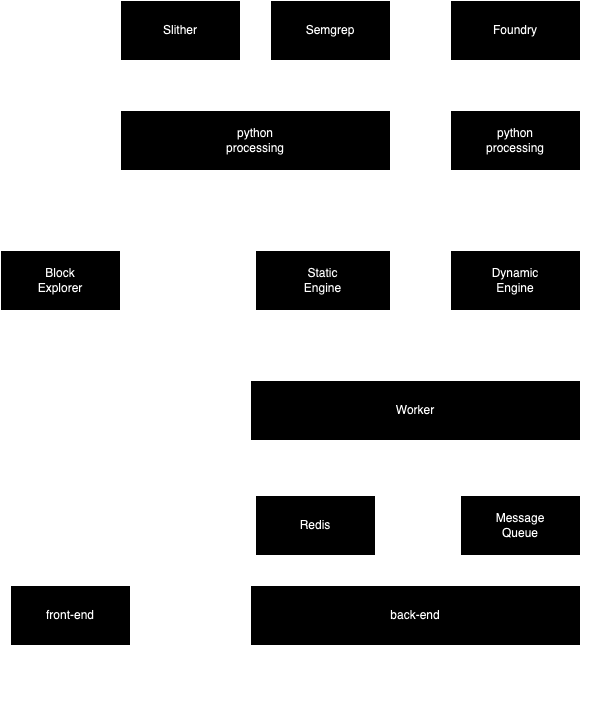

# Architecture


본 페이지에서는 프로젝트의 기술 스택, 동작 방식에 대해 설명합니다.


## 요약

본 프로젝트는 웹 서비스로 설계된 프로젝트이며 Uniswap V4의 Pool Key를 전달해 동적과 정적을 선택해 분석을 진행할 수 있습니다.&#x20;

기본적으로 사용자는 웹 환경에 접속해서 사용할 수 있습니다. Uniswap V4 Pool Manager에 Initialize된 Pool Key를 입력하면 해당 Pool Key를 기반으로 분석을 진행합니다.

해당 Pool Key에 대한 정보는 API Server에 저장하고, Message Queue에 Task를 전송합니다.

Worker는 Message Queue에 들어온 Task가 있다면 이를 실행합니다.

이후 각 Task에 따라서. 정적은 semgrep과 slither 기반으로, 동적은 Foundry 기반으로 동작한 뒤 이를 해석하고 취합한 뒤 결과를 Redis에 저장합니다.

사용자는 Task ID를 기반으로 결과를 열람할 수 있습니다.

## 매커니즘

<figure><figcaption></figcaption></figure>

## 기술 스택

### 프론트엔드

<figure><figcaption></figcaption></figure>

### 백엔드

<figure><figcaption></figcaption></figure>

<figure><figcaption></figcaption></figure>

<figure><figcaption></figcaption></figure>

### 정적분석

<figure><figcaption></figcaption></figure>

<figure><figcaption></figcaption></figure>

### 동적분석

<figure><figcaption></figcaption></figure>

